# Track Pulse

**Track Pulse** is a feature-rich offline audio player designed with a sleek Material UI dynamic color scheme, leveraging a DAO database for efficient playlist management and a robust notification media service for seamless audio playback controls.

---

## Features

### **1. Offline Audio Playback**
- Play your local audio files without requiring an internet connection.
- Support for various audio file formats.

### **2. Material UI Dynamic Color Scheme**
- Adopts Material Design principles.
- Automatically adjusts the app's theme to match your device's color scheme.

### **3. Playlist Management**
- Create, edit, and delete playlists using the integrated DAO database.
- Persist your playlists locally for offline usage.

### **4. Notification Media Service**
- Provides media playback controls directly from the notification tray.
- Seamlessly integrates with Android's media session APIs for background playback.

### **5. Search and Sort Functionality**
- Quickly find your favorite tracks using the built-in search feature.
- Sort audio files by name, duration, or date added.

### **6. Modern and Intuitive UI**
- Built with a clean and intuitive interface for a superior user experience.
- Supports light and dark mode automatically.

### **7. Background Playback**
- Continue listening to your audio files while using other apps.

---

## Technology Stack

### **Languages & Frameworks**
- **Kotlin**: Core language for Android app development.
- **Material Design 3 (Material You)**: For dynamic theming and UI components.

### **Database**
- **Room (DAO)**: Used for managing playlists and storing metadata.

### **Libraries**
- **Media3/ExoPlayer**: Handles audio playback.
- **Glide**: For image loading and caching (e.g., album art).
- **Coroutines**: Simplifies asynchronous tasks.
- **Lifecycle Components**: Ensures proper handling of UI updates and lifecycle events.

---

## Getting Started

### Prerequisites
- Android Studio Flamingo or later.
- Minimum SDK: 21 (Android 5.0 Lollipop).

### Installation
1. Clone the repository:
   ```bash
   git clone https://github.com/thechibuzor1/TrackPulse.git
   ```
2. Open the project in Android Studio.
3. Sync Gradle and build the project.
4. Run the app on an emulator or physical device.

### Permissions
Make sure the following permissions are granted:
- **READ_EXTERNAL_STORAGE**: To access local audio files.
- **FOREGROUND_SERVICE**: For background media playback.
- **POST_NOTIFICATIONS**: To display playback notifications.

---

## Code Structure

### **1. `MainActivity`**
- Entry point of the app.
- Handles audio file loading and permissions.

### **2. `PlaylistFragment`**
- Manages playlist creation, deletion, and updates.
- Displays playlists using a RecyclerView.

### **3. `AudioService`**
- Foreground service for managing media playback.
- Provides notification-based media controls.

### **4. `Database`**
- Uses Room for storing playlists.
- DAO pattern for efficient database access.

---

## Screenshots
<p float="left">
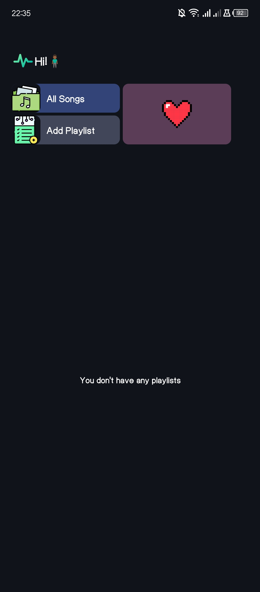
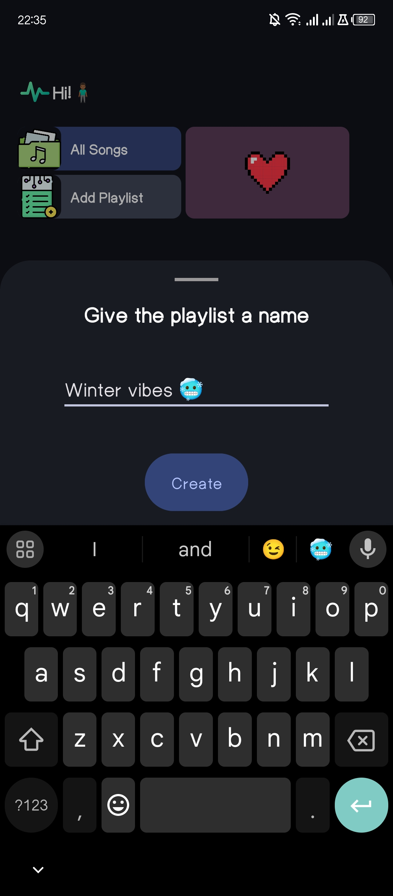
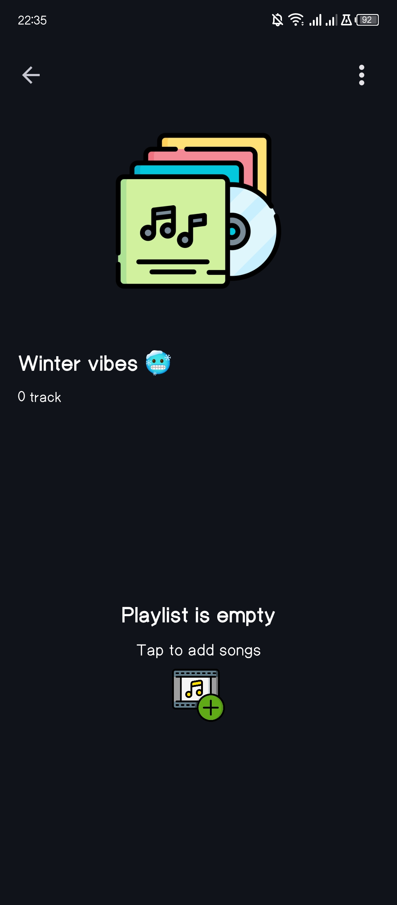
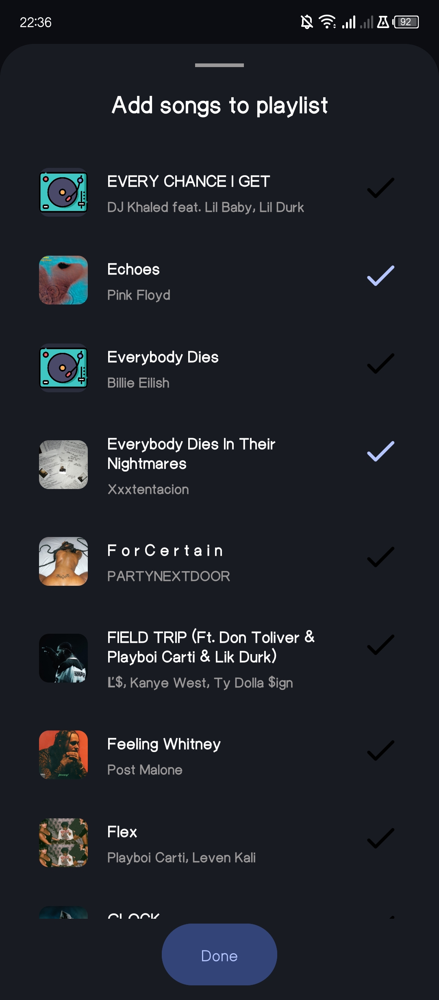
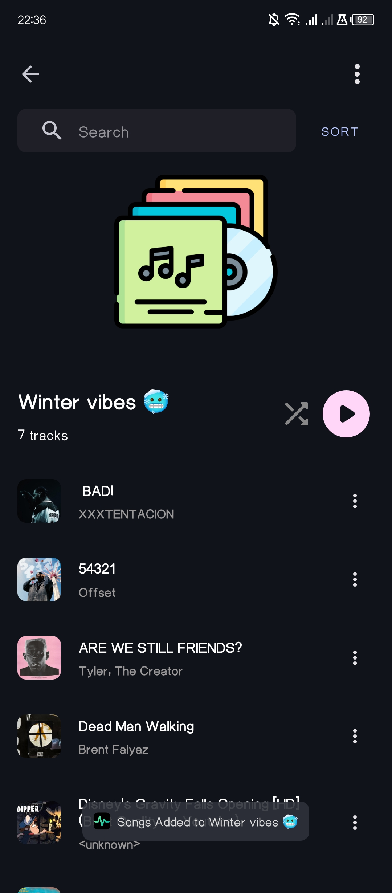
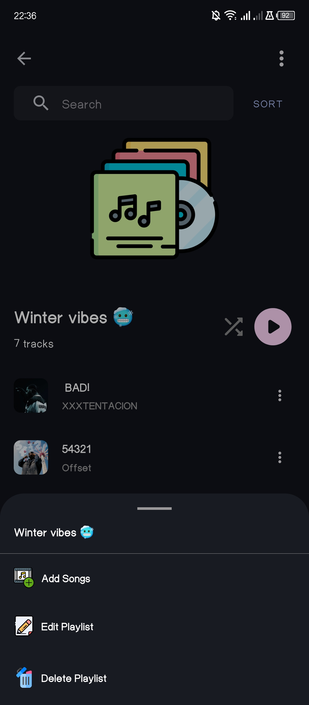
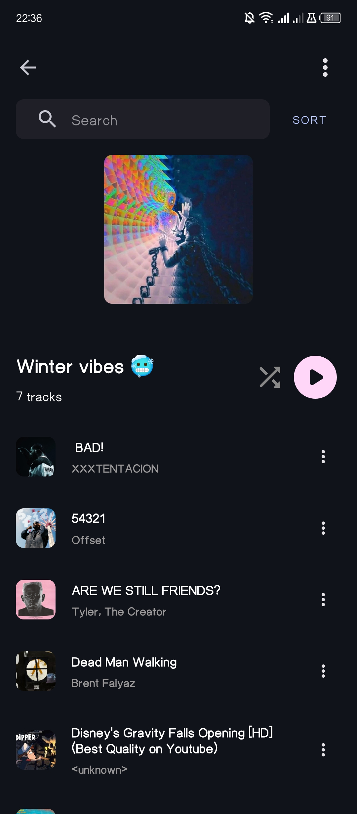
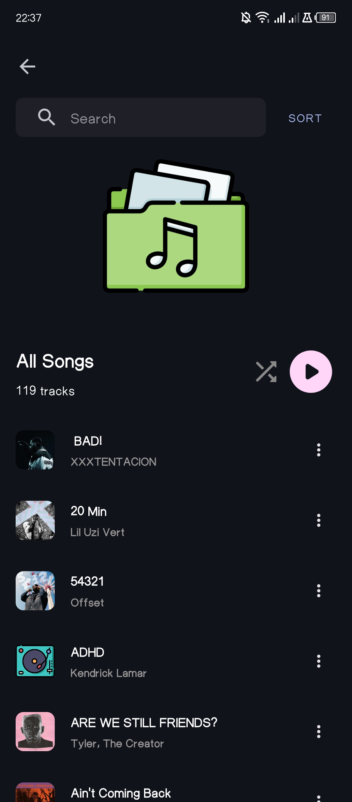
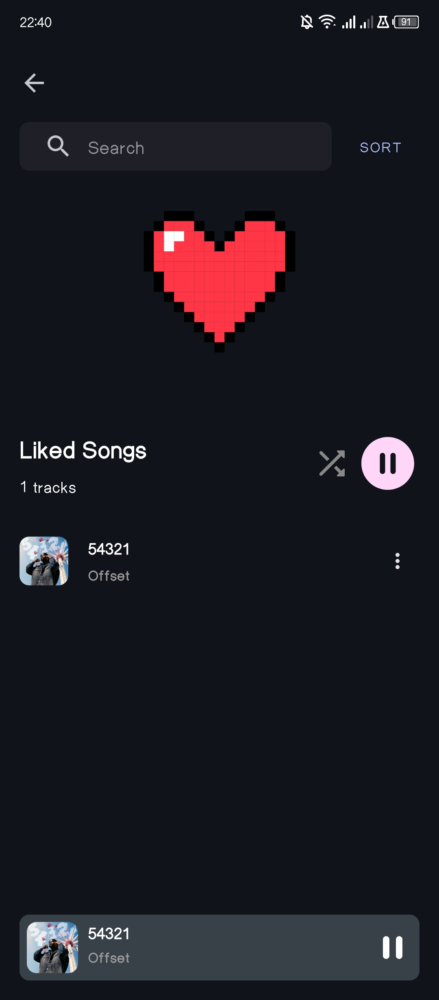
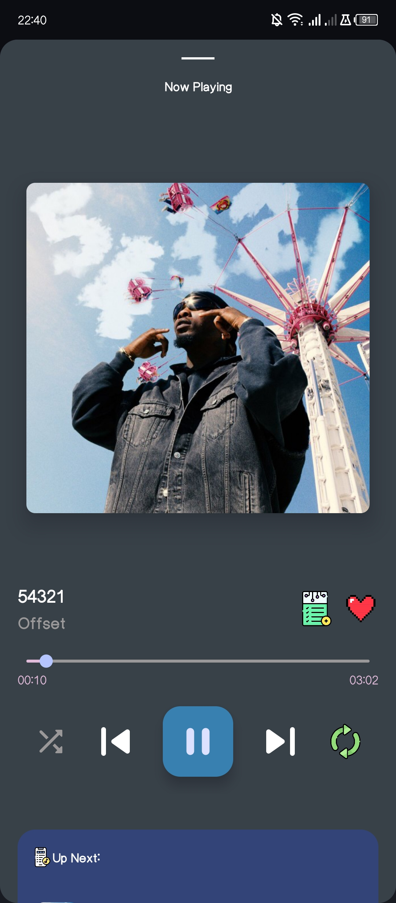
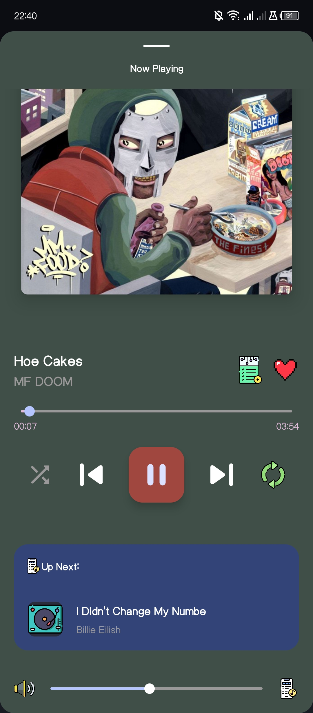
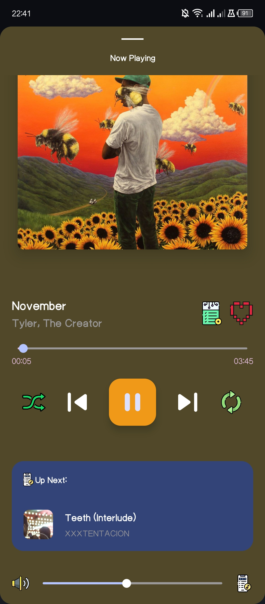
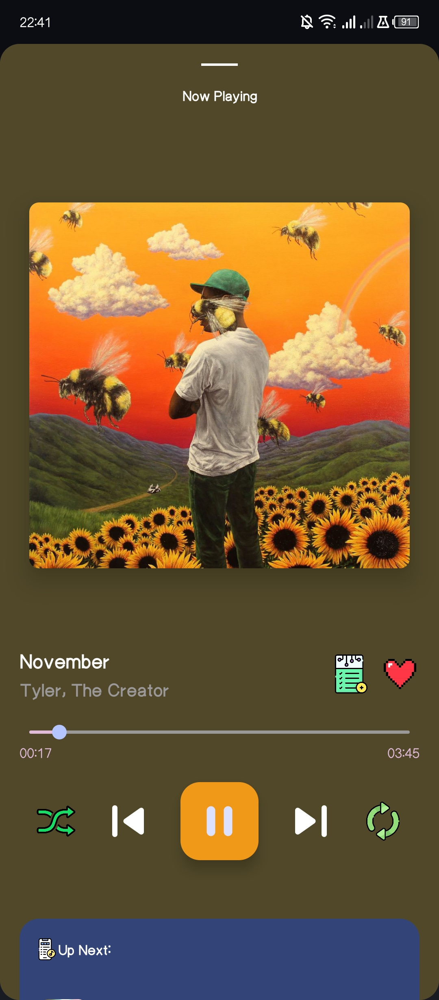
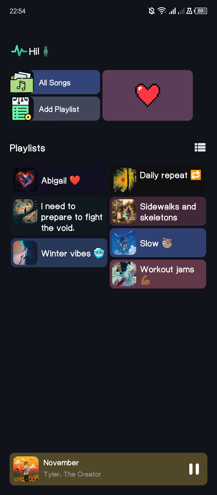
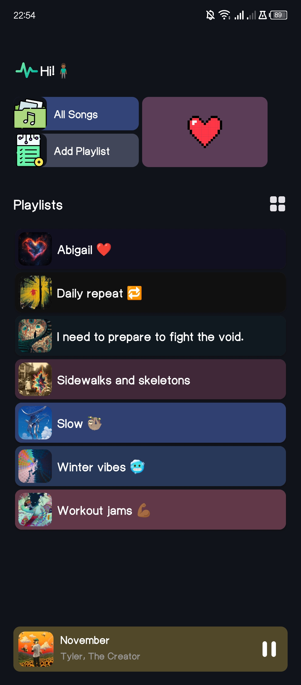
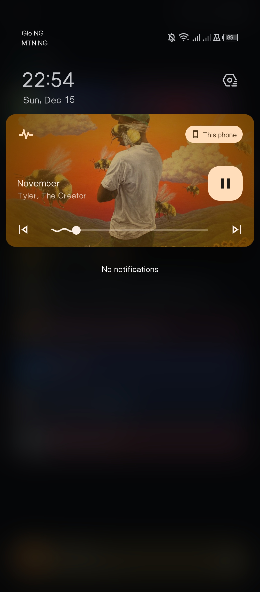
</p>

---

## Contributing
We welcome contributions! To get started:
1. Fork the repository.
2. Create a new branch for your feature or bug fix.
3. Submit a pull request with a detailed description of your changes.

---

## Contact
For any inquiries or feedback, please contact:
- **Email**: chibuzormoses20@gmail.com
- **GitHub**: [thechibuzor1](https://github.com/thechibuzor1/TrackPulse)

